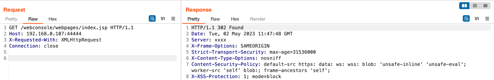
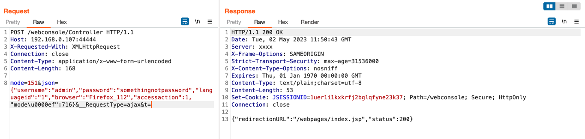
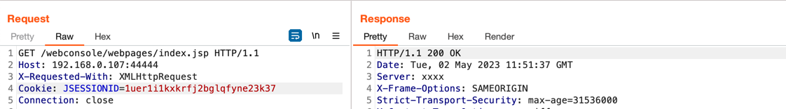

### CVE-2022-1040 Auth Bypass

很有意思的一个洞！对不同语言对json数据的解析差异进行利用，算是 [An Exploration of JSON Interoperability Vulnerabilities](https://bishopfox.com/blog/json-interoperability-vulnerabilities) 这篇文章的实践，非常值得学习与借鉴的审计思路。

环境搭建
- [Sophos XG漏洞调试环境搭建](https://3gstudent.github.io/Sophos-XG%E6%BC%8F%E6%B4%9E%E8%B0%83%E8%AF%95%E7%8E%AF%E5%A2%83%E6%90%AD%E5%BB%BA)

原理分析
- [CVE-2022-1040 Sophos XG Firewall Authentication bypass](https://blog.viettelcybersecurity.com/cve-2022-1040-sophos-xg-firewall-authentication-bypass/)

漏洞复现

1、没有有效 cocokie, 访问 302 跳转

2、通过该漏洞获取有效 cookie

3、携带有效 cookie 再次访问，200

