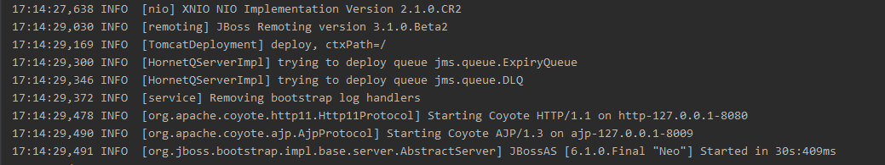
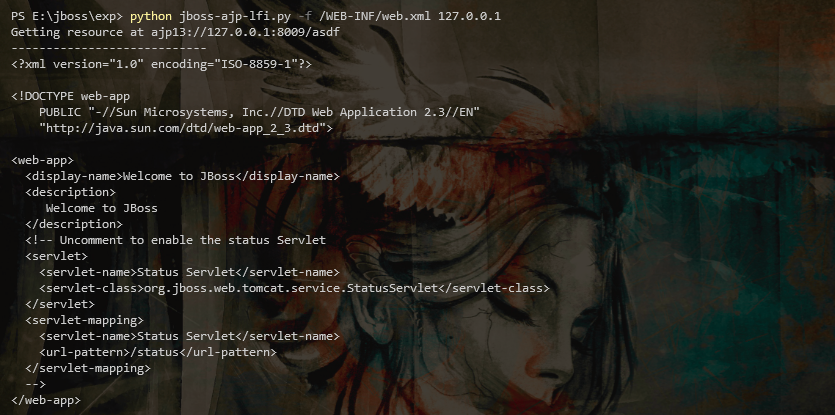

####  漏洞描述

> JBoss 低版本内置Tomcat，该版本Tomcat存在CVE-2020-1938  AJP文件包含漏洞。

####  漏洞复现

##### 环境搭建

- IDEA

- JBoss AS 6.1.0.Final





##### 漏洞验证

读取web.xml文件内容

```
python jboss-ajp-lfi.py -f /WEB-INF/web.xml 127.0.0.1
```

测试效果


