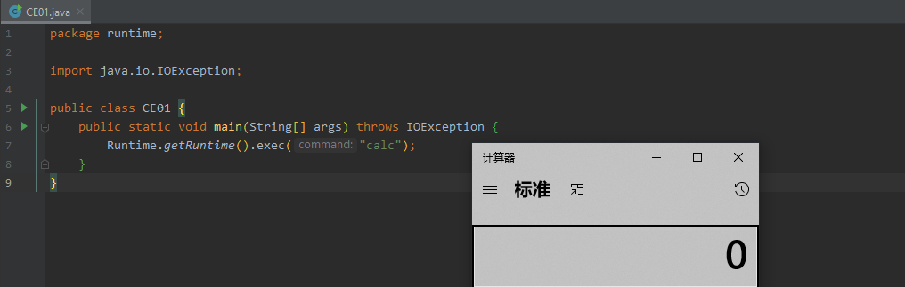
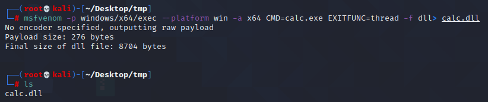
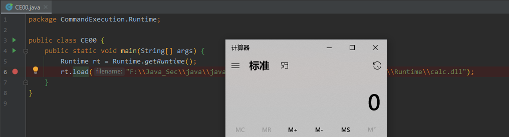
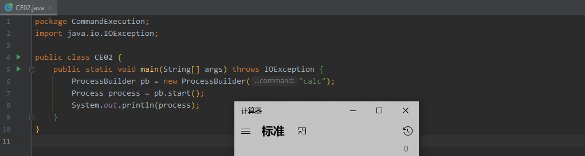
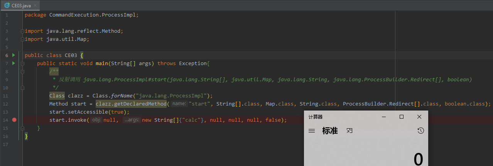

Java下几种执行命令的方式

- java.lang.Runtime
  - exec()
  - load()
- java.lang.ProcessBuilder
- java.lang.ProcessImpl
- JNI(暂放)

#### java.lang.Runtime

##### exec()

测试代码

```java
import java.io.IOException;

public class CE01 {
    public static void main(String[] args) throws IOException {
        Runtime.getRuntime().exec("calc");
    }
}
```

测试效果



调用栈

```
create:-1, ProcessImpl (java.lang)
<init>:386, ProcessImpl (java.lang)
start:137, ProcessImpl (java.lang)
start:1029, ProcessBuilder (java.lang)
exec:620, Runtime (java.lang)
exec:450, Runtime (java.lang)
exec:347, Runtime (java.lang)
main:6, CE01 (CommandExecution.Runtime)
```


##### load()

- 加载动态链接库，如linux下的so文件，windows下的dll文件。

准备dll - 弹计算器

```
msfvenom -p windows/x64/exec --platform win -a x64 CMD=calc.exe EXITFUNC=thread -f dll> calc.dll
```



测试代码

```java
package CommandExecution.Runtime;

public class CE00 {
    public static void main(String[] args) {
        Runtime rt = Runtime.getRuntime();
        rt.load("F:\\Java_Sec\\java\\java_vuln\\src\\main\\java\\CommandExecution\\Runtime\\calc.dll");
    }
}
```

测试效果



#### java.lang.ProcessBuilder

测试代码

```java
import java.io.IOException;

public class CE02 {
    public static void main(String[] args) throws IOException {
        ProcessBuilder pb = new ProcessBuilder("calc");
        Process process = pb.start();
        System.out.println(process);
    }
}
```

测试效果



调用栈

```java
create:-1, ProcessImpl (java.lang)
<init>:386, ProcessImpl (java.lang)
start:137, ProcessImpl (java.lang)
start:1029, ProcessBuilder (java.lang)
main:7, CE02 (CommandExecution.ProcessBuilder)
```

#### java.lang.ProcessImpl

测试代码

```java
import java.lang.reflect.Method;
import java.util.Map;

public class CE03 {
    public static void main(String[] args) throws Exception{
        /**
         * 反射调用 java.lang.ProcessImpl#start(java.lang.String[], java.util.Map, java.lang.String, java.lang.ProcessBuilder.Redirect[], boolean)
         */
        Class clazz = Class.forName("java.lang.ProcessImpl");
        Method start = clazz.getDeclaredMethod("start", String[].class, Map.class, String.class, ProcessBuilder.Redirect[].class, boolean.class);
        start.setAccessible(true);
        start.invoke(null, new String[]{"calc"}, null, null, null, false);
    }
}
```

测试效果




调用栈

```java
create:-1, ProcessImpl (java.lang)
<init>:386, ProcessImpl (java.lang)
start:137, ProcessImpl (java.lang)
invoke0:-1, NativeMethodAccessorImpl (sun.reflect)
invoke:62, NativeMethodAccessorImpl (sun.reflect)
invoke:43, DelegatingMethodAccessorImpl (sun.reflect)
invoke:498, Method (java.lang.reflect)
main:14, CE03 (CommandExecution.ProcessImpl)
```


