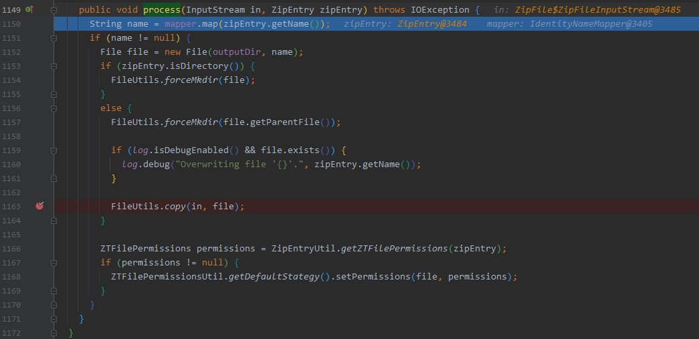
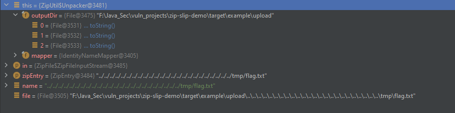

以 zt-zip v1.1.12 为例

测试环境

- https://github.com/cesarsotovalero/zip-slip-exploit-example


测试效果

> 正常压缩文件

normalCompressed.zip


解压路径

```
F:\Java_Sec\vuln_projects\zip-slip-demo\target\example\upload\flag.txt
```


> 恶意压缩文件

evilCompressed.zip


payload

```
../../../../../../../../../../../../../../../../../../../../../../../../tmp/flag.txt
```

解压路径

```
# 目录成功穿越到根目录 
F:\tmp\flag.txt
```


漏洞分析


- 判断文件是否为 .zip 后缀
- 调用 org.zeroturnaround.zip.ZipUtil#unpack  进行解压缩

调用栈

```java
process:1150, ZipUtil$Unpacker (org.zeroturnaround.zip)
iterate:508, ZipUtil (org.zeroturnaround.zip)
iterate:472, ZipUtil (org.zeroturnaround.zip)
unpack:996, ZipUtil (org.zeroturnaround.zip)
unpack:939, ZipUtil (org.zeroturnaround.zip)
doPost:56, UploadServlet (se.kth.servlet)
...
```



- 执行到org.zeroturnaround.zip.ZipUtil.Unpacker#process方法，调用 java.util.zip.ZipEntry#getName 获取 entry 的 name

- 与`outputDir` 进行拼接创建一个 File 实例 `file`

    - 未对获取到的路径进行校验

  

- 最后调用org.zeroturnaround.zip.commons.FileUtils#copy 将输入流复制到实例`file`（写入文件）。


漏洞修复

pom.xml

```xml
<dependency>
    <groupId>org.zeroturnaround</groupId>
    <artifactId>zt-zip</artifactId>
    <version>1.13</version>
    <type>jar</type>
</dependency>
```


在文件写入之前，进行了两处判断

- `name` 中是否出现了 `··`
- `file` 的规范路径名的前缀是否为 `outputDir` 的规范路径名
    - getCanonicalPath()
        - 返回绝对唯一的标准规范路径名，即会删除路径中的 `.` 和 `..` 。
        - 会解析软链接（在UNIX平台上）


> ps：感觉这里在Linux平台上可以利用 条件竞争 + 软链接 进行绕过（实战意义不大、积累思路）


ref:

- https://github.com/snyk/zip-slip-vulnerability
- https://github.com/cesarsotovalero/zip-slip-exploit-example


